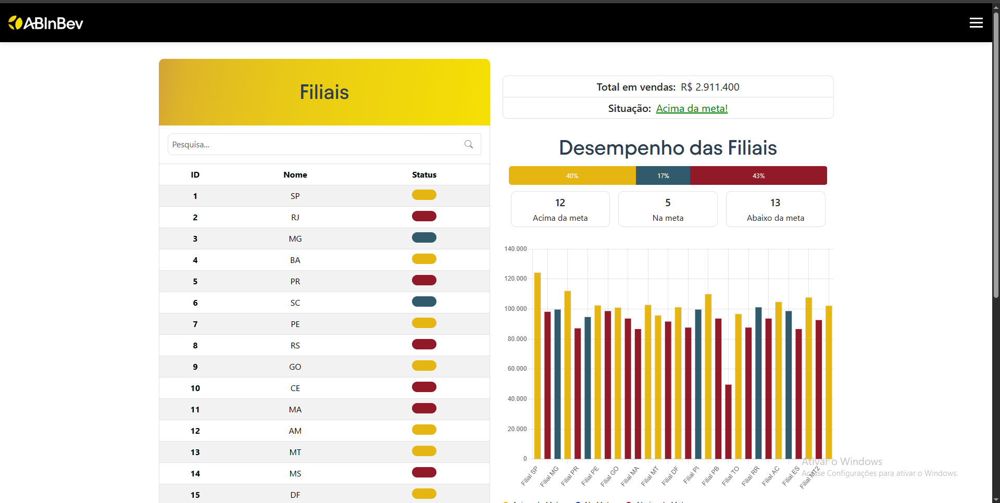

# Tabela Responsiva — Dashboard de Filiais

Este projeto é um dashboard responsivo para visualização e análise de dados de filiais. 
Desenvolvido para demonstrar habilidades em front-end, manipulação de dados e experiência do usuário.

## Funcionalidades

- **Visualização de Dados das Filiais por meio da Tabela:**
  - Tabela com as informações de cada filial, em primeira vista estão apenas os nomes e o status da filial. Ao clicar sobre um item da tabela será aberto um modal contendo todas as outras informações da filial de forma detalhada.

- **Sistema de pesquisa:**
  - Acima da tabela terá uma barra de pesquisa para facilitar a busca por uma determinada filial.
  - A pesquisa pode ser feita por meio do ID ou nome.

- **Gráficos Dinâmicos:**
  - Barra de progresso mostrando percentuais de filiais em cada status.
  - Três blocos mostrando o número de filiais de acordo com seu status: acima da meta, abaixo ou na meta.
  - O Gráfico de barras mostra o valor em R$ das vendas de cada filial.
  - Cores indicam o status: acima da meta, na meta ou abaixo da meta.
  - Quando uma pesquisa é realizada, os dados do Gráfico, Total em Vendas e Desempenho das Filiais serão atualizados de acordo com os resultados obtidos.

- **Indicador de Situação:**
  - Exibe a situação geral das filiais (acima da meta, dentro do esperado ou abaixo do esperado).
  - Ao clicar na situação, abre-se um modal explicativo, incluindo uma lista das filiais com vendas abaixo da média ideal.

- **Responsividade:**
  - O site se adapta respondendo aos diferentes tamanhos de tela.
  - Mobile:
    - Tabela, total em vendas, situação, desempenho das filiais e o gráfico. 
    - Botão de voltar ao topo.
  - Desktop:
    - Divide a tela em duas colunas.
    - Tabela na esquerda, total em vendas, situação, desempenho das filiais e o gráfico na direita.

## Como Abrir

1. Clone ou baixe este repositório.
2. Abra o arquivo `index.html` no navegador e estará funcionando.

## Acesse o Projeto Online

O projeto também pode ser visto também no seguinte link: [https://tabela-responsiva.vercel.app](https://tabela-responsiva.vercel.app)

O deploy foi feito com o uso da plataforma da Vercel https://vercel.com

## Tecnologias Utilizadas
- HTML5
- CSS3
- - JavaScript
- Bootstrap (Foi usado para criar o layout inicial do site, ajudando na responsividade e estilização)
  - Grid Layout para a distribuição das colunas e melhor adaptação aos diferentes tamanhos de tela
- Chart.js (Para os gráficos)

## Tela Principal

